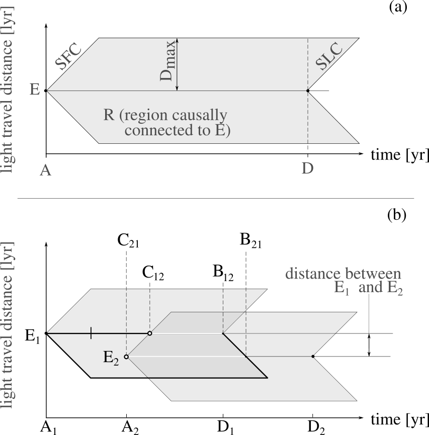
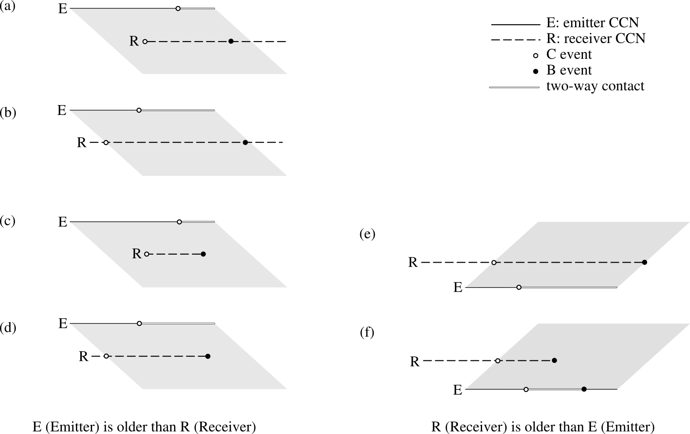

************
Proposal
************

Methods and working hypothesis
==============================

Simulations are suitable tools to analyze systems that evolve with
time and involve randomness.

An advantage of simulations compared to theoretical approaches, is
that the former usually require less assumptions and simplifications,
and can be applied to systems where a theoretical model can not be
found.

In particular, many complex stochastic processes that can be described
by the evolution of the state of a system, can be efficiently modeled
with the discrete--event (hereafter, DE) simulation approach.

A system described with the DE paradigm is characterized by a set of
actors and events, where actors interact causally through a series of
events on a timeline and process these events in chronological order

   Space-time diagrams showing the causal contact connections.

   All possible cases for the generation of events.
